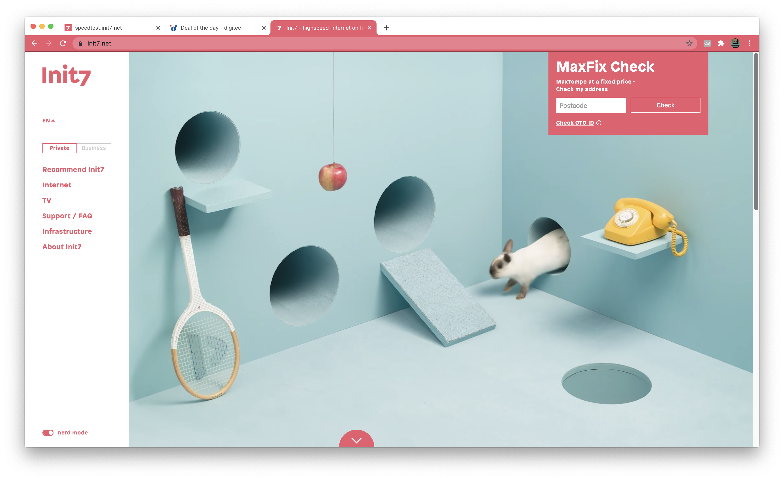

# "Unofficial" Init7 Web Browser Rot Themes
> The unofficial Web Browser theme for Swiss Internet Service Provider - Init7

## User Install
1. [**Chrome Web Store**](https://chrome.google.com/webstore/detail/init7-red/dpknnolglkdbhlicgloigkoplpjenfje) Chromium _(Brave, Chrome, Edge, etc.)_
1. [**Mozilla Add-ons**](https://addons.mozilla.org/en-US/firefox/addon/init7-rot/) Firefox

## Support
- [Raise an issue](https://github.com/mountainash/Init7-WebBrowser-Theme/issues)

## Developer Install & Debugging
### Chromium
1. Git clone this project
1. In a Chromium based browser, open **Settings**
1. Go to **Extensions**
1. Switch on **Developer mode**
1. **Load unpacked** and open the [`chromium/`](./chromium/) directory

### Firefox
1. Git clone this project
1. Enter `about:debugging` into the address bar
1. Click the **Load Temporary Add-on...** and open the `manifest.json` in the [`firefox/`](./firefox/) directory

## Contributors Help
### Theme Documentation
- [Developer: Chrome Themes](https://developer.chrome.com/apps/themes)
- [Chrome Theme Reference](https://docs.google.com/document/d/1jt9vdUY9O5IMm6Zoi2Kz0LWFfFZpvP69qjy6PoGsEoA/edit)
- [Firefox Theme MDN](https://developer.mozilla.org/en-US/docs/Mozilla/Add-ons/WebExtensions/manifest.json/theme)

### Vendors Developer Dashboards
- [Chrome Web Store](https://chrome.google.com/webstore/devconsole/)
- [Mozilla Add-on Developer Hub](https://addons.mozilla.org/en-US/developers/)

### Definitions
- `ntp` = "New Tab Page"
- `inactive` = When the browser is not the active app (but you can see the window in the background)

###  Theme Colors
| Name | HEX | RGB |
|---|---|---|
| Rot/Pink | `#EB5A6D` | `[235, 90, 109]` |
| White | `#FFF` | `[255, 255, 255]` |
| Black | `#000` | `[0, 0, 0]` |

### Tints Help
Tints are in Hue-Saturation-Lightness (HSL) format, using floating-point numbers in the range `0 - 1.0`:

- **Hue** is an absolute value, with `0` and `1` being red.
- **Saturation** is relative to the currently provided image. `0.5` is no change, `0` is totally unsaturated, and `1` is full saturation.
- **Lightness** is also relative, with `0.5` being no change, `0` as all pixels black, and `1` as all pixels white.

You can alternatively use `-1.0` for any of the HSL values to specify no change.

## Distribution

### Chrome Web Store
1. In a Chromium based browser, open **Settings** and go to **Extensions** (chrome://extensions/)
1. Load the unpacked [`chromium/`](./chromium/) directory - check everything looks OK
1. Zip the `chromium` directory `zip -r init7.zip chromium -x "**/.DS_Store*"`
1. Upload it to the [Chrome Web Store](https://chrome.google.com/webstore/developer/dashboard)

[Full official instructions](https://developer.chrome.com/docs/webstore/publish/)

### Developer Wishlist
- [ ] Hope that Browsers implement an inactive setting for bookmark text (eg. `colors.bookmark_text_inactive` or `tints.buttons_inactive`)
- [ ] Hope that Chromium implements a background image size setting (eg. `properties.ntp_background_size`)

## NOTE
- This theme has not been endorsed or approved by [Init7](https://www.init7.net/) and as such they can't support it. [Raise an issue](https://github.com/mountainash/Init7-WebBrowser-Theme/issues) if you have any problems or suggestions.